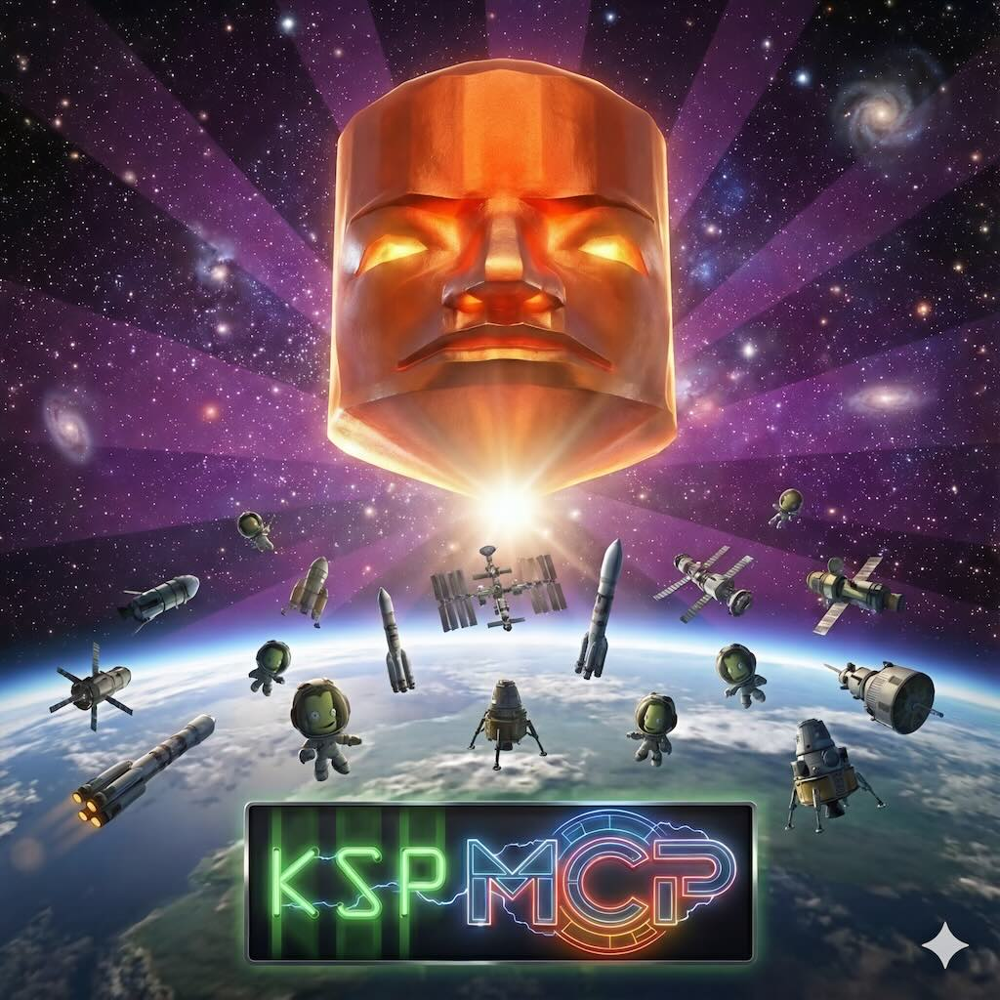

<p align="center">
  
</p>

# ksp-mcp

STATUS: EARLY DEV


## Prologue

Long before the first brave Kerbal dared to ask “what does this button do?”, the engineers back on Kerbin reached a hard limit: thinking is heavy.

Deep-space vessels simply can’t carry the mass, power draw, or cooling systems required to run advanced LLMs onboard. The solution isn't more batteries or bigger radiators -- it's cloud hosting on KWS, Koogle, and Kzure!

ksp-mcp will allow spacecraft to utilizie and be utilized by LLMs hosted on Kerbin.

## Purpose Beyond 4th Wall

MCP (Model Context Protocol) server for Kerbal Space Program automation via kOS and MechJeb2.

Enables LLMs to directly control KSP spacecraft through kOS scripting and MechJeb autopilot features.

## Prerequisites

- **Kerbal Space Program** with the following mods:
  - [kOS](https://github.com/KSP-KOS/KOS) - Scripting and automation
  - [MechJeb2](https://github.com/MuMech/MechJeb2) - Autopilot and maneuver planning (dev version needed)
  - [kOS.MechJeb2.Addon](https://github.com/belpyro/kOS.MechJeb2.Addon) - Exposes MechJeb to kOS (in active dev)

- **kOS Telnet Server** enabled (configured in KSP settings)

## Installation

```bash
npm install ksp-mcp
```

Or from source:

```bash
git clone https://github.com/caseys/ksp-mcp
cd ksp-mcp
npm install
npm run build
```

## Usage

### As a TypeScript/JavaScript Library

Import ksp-mcp directly in your TypeScript or JavaScript projects:

```typescript
import { KosConnection, config } from 'ksp-mcp';

// Connect to kOS
const conn = new KosConnection();
await conn.connect();

// Execute kOS commands
const result = await conn.execute('PRINT "Hello from kOS".');
console.log(result.output);

// Disconnect
await conn.disconnect();
```

#### Available Exports

```typescript
// Core connection
import { KosConnection } from 'ksp-mcp';
import type { ConnectionState, CommandResult, KosConnectionOptions } from 'ksp-mcp';

// Transport layer
import { BaseTransport, SocketTransport, TmuxTransport } from 'ksp-mcp';
import type { Transport } from 'ksp-mcp';

// MechJeb interface - High-level (recommended)
import { ManeuverOrchestrator, withTargetAndExecute } from 'ksp-mcp';
import type { ManeuverOptions, OrchestratedResult } from 'ksp-mcp';

// MechJeb interface - Low-level
import { MechJebClient, ManeuverProgram, AscentProgram, AscentHandle } from 'ksp-mcp';

// MechJeb operations (direct functions)
import {
  executeNode, getNodeProgress,
  ellipticize, changeSemiMajorAxis,
  changeEccentricity, changeLAN, changeLongitudeOfPeriapsis,
  matchPlane, killRelativeVelocity,
  resonantOrbit, returnFromMoon, interplanetaryTransfer
} from 'ksp-mcp';

// MechJeb telemetry
import { getVesselState, getOrbitInfo, getMechJebInfo, getQuickStatus, getShipTelemetry } from 'ksp-mcp';
import type { ShipTelemetry, VesselInfo, OrbitTelemetry, ManeuverInfo, EncounterInfo, TargetInfo } from 'ksp-mcp';

// MechJeb discovery
import { discoverModules, isMechJebAvailable } from 'ksp-mcp';

// Configuration
import { config } from 'ksp-mcp';
import type { Config } from 'ksp-mcp';

// MCP Server
import { createServer } from 'ksp-mcp';

// Tool handlers (for direct use without MCP)
import { handleConnect, handleDisconnect, handleExecute, handleStatus, getConnection } from 'ksp-mcp';
import { handleListCpus } from 'ksp-mcp';
import type { CpuInfo } from 'ksp-mcp';

// Connection monitoring
import { KosMonitor, globalKosMonitor } from 'ksp-mcp';
import type { MonitorStatus, LoopDetection } from 'ksp-mcp';

// Save/Load (KUNIVERSE)
import { listQuicksaves, quicksave, quickload, canQuicksave } from 'ksp-mcp';

// Subpath imports also available
import { KosConnection } from 'ksp-mcp/transport';
import { MechJebClient, ManeuverOrchestrator } from 'ksp-mcp/mechjeb';
import { config } from 'ksp-mcp/config';
import { createServer } from 'ksp-mcp/server';
import * as daemon from 'ksp-mcp/daemon';  // Persistent connection daemon
```

### As MCP Server (Stdio - Default)

For Claude Desktop and local tools:

```bash
# Start with stdio transport (default)
ksp-mcp

# Or explicitly
ksp-mcp --transport stdio
```

Configure in Claude Code's MCP settings:

```json
{
  "mcpServers": {
    "ksp-mcp": {
      "command": "npx",
      "args": ["ksp-mcp"]
    }
  }
}
```

Or with a local installation:

```json
{
  "mcpServers": {
    "ksp-mcp": {
      "command": "node",
      "args": ["/path/to/ksp-mcp/dist/index.js"]
    }
  }
}
```

### As MCP Server (HTTP - Network)

For network access using the [Streamable HTTP transport](https://modelcontextprotocol.io/specification/2025-03-26/basic/transports):

```bash
# Start on localhost:3000 (stateful - session-based)
ksp-mcp --transport http --port 3000

# Listen on all interfaces
ksp-mcp --transport http --host 0.0.0.0 --port 3000

# Stateless mode (no session management)
ksp-mcp --transport http --stateless
```

Endpoints:
- `POST/GET/DELETE /mcp` - MCP Streamable HTTP endpoint
- `GET /health` - Health check (shows session count)

Clients connect by POSTing to `/mcp`. The server returns a session ID in the `mcp-session-id` header which must be included in subsequent requests.

### Direct Script Usage

All maneuver commands support `--no-execute` to plan only (create node without executing).

```bash
# Ascent
npm run launch-ascent              # Launch to orbit with MechJeb

# Basic orbital maneuvers (auto-execute by default)
npm run circularize                    # Circularize at apoapsis
npm run circularize PERIAPSIS          # Circularize at periapsis
npm run circularize -- --no-execute    # Plan only
npm run adjust-periapsis    # Adjust periapsis
npm run adjust-apoapsis     # Adjust apoapsis
npm run ellipticize         # Set both Pe and Ap
npm run change-semi-major-axis    # Change semi-major axis

# Orbital adjustments
npm run change-inclination 0                       # Change to 0° inclination
npm run change-inclination 0 EQ_NEAREST_AD         # Specify timing
npm run change-inclination 0 -- --no-execute       # Plan only
npm run change-eccentricity        # Change eccentricity
npm run change-ascending-node      # Change longitude of ascending node
npm run change-periapsis-longitude # Change longitude of periapsis

# Transfers
npm run hohmann-transfer                   # Transfer to Mun (default)
npm run hohmann-transfer Minmus            # Transfer to Minmus
npm run hohmann-transfer Mun -- --capture  # Include capture burn
npm run hohmann-transfer -- --no-execute   # Plan only
npm run course-correct      # Fine-tune approach
npm run interplanetary-transfer    # Interplanetary transfer
npm run return-from-moon    # Return from moon
npm run resonant-orbit      # Resonant orbit for satellite deployment

# Rendezvous
npm run set-target          # Set navigation target
npm run match-planes        # Match orbital plane
npm run match-velocities    # Match velocities at closest approach

# Node execution
npm run execute-node        # Execute next maneuver node

# Time warp
npm run warp                # Control time warp

# Save/Load
npm run load-save           # Load a saved game

# Daemon (persistent connection)
npm run daemon:start        # Start kOS connection daemon
npm run daemon:status       # Check daemon status
npm run kos                 # Execute kOS command via daemon
```

## MCP Tools

> **Note:** Connection to kOS is automatic. All tools auto-connect when called.

### Connection & Utility

- **status** - Get ship telemetry (returns structured JSON with vessel, orbit, maneuver, encounter, target, and formatted output)
- **disconnect** - Disconnect from kOS
- **command** - Execute raw kOS commands
- **list_cpus** - List available kOS CPUs
- **switch_cpu** - Set CPU preference for session (by ID or label), or clear to auto-select

### Targeting

- **set_target** - Set navigation target (body or vessel)
- **get_target** - Get current target info
- **clear_target** - Clear current target

### Time Control

- **warp** - Time warp to event (soi, node, periapsis, apoapsis) or seconds

### Save/Load

- **load_save** - Load a saved game
- **list_saves** - List available saves
- **quicksave** - Create a quicksave

### Basic Maneuvers

- **adjust_periapsis** - Change periapsis altitude
- **adjust_apoapsis** - Change apoapsis altitude
- **circularize** - Circularize orbit
- **ellipticize** - Set both periapsis and apoapsis
- **change_semi_major_axis** - Change semi-major axis

### Orbital Adjustments

- **change_inclination** - Change orbital inclination
- **change_eccentricity** - Change orbital eccentricity
- **change_ascending_node** - Change longitude of ascending node
- **change_periapsis_longitude** - Change longitude of periapsis

### Rendezvous

- **match_planes** - Match orbital plane with target
- **match_velocities** - Match velocity with target

### Transfers

- **hohmann_transfer** - Plan Hohmann transfer to target
- **course_correct** - Fine-tune closest approach
- **resonant_orbit** - Create resonant orbit
- **return_from_moon** - Return from moon to parent body
- **interplanetary_transfer** - Plan interplanetary transfer

### Node Execution

- **execute_node** - Execute next maneuver node
- **clear_nodes** - Remove all maneuver nodes

### Ascent

- **launch_ascent** - Launch to orbit

### Emergency

- **crash_avoidance** - Emergency burn to raise periapsis

## MCP Resources

Read-only data endpoints for MCP clients. Access via `resources/read`:

- **ksp://status** - Ship telemetry (structured JSON)
- **ksp://targets** - Available bodies and vessels
- **ksp://target** - Current navigation target
- **ksp://saves** - Available quicksaves

### Status Resource Schema

The `ksp://status` resource returns structured data:

```json
{
  "vessel": {
    "name": "My Ship",
    "type": "Ship",
    "status": "ORBITING"
  },
  "orbit": {
    "body": "Kerbin",
    "apoapsis": 150000,
    "periapsis": 100000,
    "period": 2400,
    "inclination": 0.5,
    "eccentricity": 0.015,
    "lan": 45.2
  },
  "maneuver": {
    "deltaV": 500.5,
    "timeToNode": 300,
    "estimatedBurnTime": 45
  },
  "encounter": {
    "body": "Mun",
    "periapsis": 50000
  },
  "target": {
    "name": "Mun",
    "type": "Body",
    "distance": 12000000
  },
  "formatted": "=== Ship Status ===\nVessel: My Ship (Ship) - ORBITING\n..."
}
```

Optional fields (`maneuver`, `encounter`, `target`) are only present when applicable.

## MCP Prompts

Workflow templates for common missions:

- **launch-to-orbit** - Standard ascent workflow
  - Args: `altitude` (optional, default "80km")
- **transfer-to-moon** - Moon transfer sequence
  - Args: `target` (required: "Mun" or "Minmus")
- **return-to-kerbin** - Return from moon
  - Args: `targetPeriapsis` (optional, default "40km")

## Example Mission Flow

### Using MCP Tools

```javascript
// Connection is automatic - just call the tools you need!

// 1. Launch to orbit
await launch({ altitude: 150000, inclination: 0 });

// 2. Set target and plan transfer
await set_target({ name: "Mun" });
await hohmann();
await execute_node();

// 3. Course correction
await course_correct({ targetDistance: 50000 });
await execute_node();

// 4. Warp to Mun, then circularize
await warp({ target: "soi" });
await circularize({ timeRef: "PERIAPSIS" });
await execute_node();
```

### Using Library API

The library follows a "library-first" architecture where CLI and MCP are thin wrappers over the core library.

```typescript
import { KosConnection, ManeuverOrchestrator } from 'ksp-mcp';

const conn = new KosConnection();
await conn.connect();

const orchestrator = new ManeuverOrchestrator(conn);

// Transfer to Mun with auto-execution
const result = await orchestrator.hohmannTransfer('COMPUTED', false, {
  target: 'Mun',    // Auto-sets target
  execute: true,    // Auto-executes node (default)
});

if (result.success) {
  console.log(`Transfer complete! ΔV: ${result.deltaV} m/s`);
}

// Or plan without executing
const planOnly = await orchestrator.circularize('APOAPSIS', { execute: false });
console.log(`Node created: ${planOnly.deltaV} m/s`);

await conn.disconnect();
```

#### Low-level API

For more control, use `ManeuverProgram` directly:

```typescript
import { KosConnection, ManeuverProgram, executeNode } from 'ksp-mcp';

const conn = new KosConnection();
await conn.connect();

const maneuver = new ManeuverProgram(conn);

// Set target manually
await maneuver.setTarget('Mun', 'body');

// Plan transfer (does not execute)
const result = await maneuver.hohmannTransfer('COMPUTED', false);

// Execute separately
if (result.success) {
  await executeNode(conn);
}

await conn.disconnect();
```

## Configuration

Create a `.env` file (or copy from `.env.example`):

```bash
# kOS Telnet Server
KOS_HOST=127.0.0.1
KOS_PORT=5410

# Default CPU selection
KOS_CPU_ID=0
# or use label:
# KOS_CPU_LABEL=guidance
```

## Project Structure

```
src/
├── cli/                        # CLI command entry points
│   ├── mechjeb/                # MechJeb maneuver commands
│   │   ├── ascent/             # Launch commands
│   │   ├── basic/              # Basic maneuvers (circularize, etc.)
│   │   ├── orbital/            # Orbital adjustments
│   │   ├── rendezvous/         # Rendezvous operations
│   │   └── transfer/           # Transfer maneuvers
│   ├── kos/                    # kOS utility commands
│   └── daemon-cli.ts           # Daemon control
├── lib/                        # Core library (public API)
│   ├── index.ts                # Public exports
│   ├── types.ts                # Type definitions
│   ├── mechjeb/                # MechJeb operations
│   │   ├── orchestrator.ts     # High-level API with target/execute
│   │   ├── ascent.ts           # Ascent guidance
│   │   ├── telemetry.ts        # Vessel/orbit info
│   │   ├── basic/              # Basic maneuvers
│   │   ├── orbital/            # Orbital adjustments
│   │   ├── rendezvous/         # Rendezvous operations
│   │   └── transfer/           # Transfer maneuvers
│   └── kos/                    # kOS utilities (warp, nodes, etc.)
├── service/                    # Server implementations
│   ├── http-server.ts          # MCP server (stdio + HTTP)
│   └── cli-daemon.ts           # Background connection daemon
├── transport/                  # kOS connection layer
│   ├── kos-connection.ts       # Main connection class
│   ├── socket-transport.ts     # TCP socket transport
│   └── tmux-transport.ts       # Tmux transport (fallback)
├── config/                     # Configuration
└── utils/                      # Utility functions
```


## CLI Options

```
ksp-mcp [options]

Options:
  -t, --transport <type>  Transport type: stdio (default), http
  -p, --port <port>       Port for HTTP transport (default: 3000)
  -h, --host <host>       Host for HTTP transport (default: 127.0.0.1)
  --stateless             Run HTTP in stateless mode (no sessions)
  --help                  Show help
```


## Implementation Notes

### kOS Protocol and Completion Detection

ksp-mcp uses several patterns for reliable command completion detection with kOS:

#### Sentinel-Based Completion
For most commands, `KosConnection.execute()` automatically injects a sentinel marker after each command. The flow is:
1. Send the user command
2. Send `PRINT "__MCP_DONE_<token>__".` with a unique token
3. Wait for the sentinel in output - this confirms kOS executed both commands
4. Strip echoes, prompts, and sentinel from output

See `docs/kos-protocol-analysis.md` for complete protocol details.

#### Outcome-Based Polling
For long-running operations like time warp, polling the actual outcome is more reliable than checking operation status:

- **SOI Warp**: Poll `SHIP:BODY:NAME` until it changes (detects SOI crossing)
- **Node Warp**: Poll `NEXTNODE:ETA` until close to target time
- **Orbital Point Warp**: Poll `ETA:PERIAPSIS` or `ETA:APOAPSIS`

This pattern is used because during high time warp, kOS responses can be delayed or unreliable.

#### Flag-Based Completion
For complex operations like node execution:
1. Set a kOS-side flag: `SET MCP_BURN_DONE TO FALSE.`
2. Install a WHEN trigger: `WHEN NOT HASNODE THEN { SET MCP_BURN_DONE TO TRUE. }`
3. Poll the flag: `PRINT MCP_BURN_DONE.`

### Time Warp Commands
Use `KUNIVERSE:TIMEWARP:WARPTO()` (non-blocking) rather than `WARPTO()` (blocking) for better control over warp completion detection.

## Development & Debugging

### Testing Blocking Operations

When testing operations that may block (like time warp), run them in background processes:

```bash
# Run a blocking test in background
node -e "
const { KosConnection } = require('./dist/transport/kos-connection.js');
const { warpTo } = require('./dist/mechjeb/programs/warp.js');

async function test() {
  const conn = new KosConnection();
  await conn.connect();
  const result = await warpTo(conn, 'soi', { timeout: 300000 });
  console.log('Result:', JSON.stringify(result, null, 2));
}
test().catch(console.error);
" &
```

### Background Monitoring

Monitor kOS state while tests run:

```bash
# Monitor body, warp level, and SOI ETA every 2 seconds
node -e "
const { KosConnection } = require('./dist/transport/kos-connection.js');
async function monitor() {
  const conn = new KosConnection();
  await conn.connect();
  setInterval(async () => {
    const result = await conn.execute('PRINT SHIP:BODY:NAME + \"|\" + WARP.', 2000);
    console.log(new Date().toISOString().substr(11,8), result.output.trim());
  }, 2000);
}
monitor().catch(console.error);
" &
```

This helps debug issues where operations complete in KSP but detection fails.

### Using the ksp-mcp REPL

For interactive debugging, use the daemon with raw kOS commands:

```bash
npm run daemon:start
npm run kos "PRINT SHIP:BODY:NAME."
npm run kos "PRINT WARP."
npm run kos "PRINT SHIP:ORBIT:HASNEXTPATCH."
```

## Contributing: Adding a New Tool

This project maintains parity between MCP tools and CLI scripts. Both interfaces are thin wrappers around shared library functions.

### Architecture

```
┌─────────────────────────────────────────────────────┐
│  CLI (stdio)          │  MCP Server (stdio/http)   │
│  - Parse args         │  - Parse JSON-RPC          │
│  - Format output      │  - Format responses        │
└───────────┬───────────┴───────────┬─────────────────┘
            │                       │
            ▼                       ▼
┌─────────────────────────────────────────────────────┐
│              Shared Libraries                        │
│  - KosConnection      - ManeuverProgram             │
│  - AscentProgram      - executeNode()               │
│  - getShipTelemetry() - clearNodes()                │
└─────────────────────────────────────────────────────┘
```

### Steps to Add a New Tool

1. **Implement the library function** in `src/mechjeb/programs/` (or appropriate location)
   ```typescript
   // src/mechjeb/programs/example.ts
   export async function myOperation(conn: KosConnection, param: number): Promise<OperationResult> {
     // Implementation using conn.execute()
   }
   ```

2. **Add the MCP tool** in `src/server.ts`
   ```typescript
   server.registerTool(
     'my_operation',  // Use snake_case for MCP tools
     {
       description: 'Does something useful',
       inputSchema: { param: z.number() },
     },
     async (args) => {
       const result = await myOperation(conn, args.param);
       return result.success ? successResponse(...) : errorResponse(...);
     }
   );
   ```

3. **Add the CLI script** in `src/cli/` (use kebab-case matching the MCP name)
   ```typescript
   // src/cli/my-operation.ts
   import { KosConnection } from '../transport/kos-connection.js';
   import { myOperation } from '../mechjeb/programs/example.js';

   async function main() {
     const conn = new KosConnection({ cpuLabel: 'guidance' });
     await conn.connect();
     const result = await myOperation(conn, parseInt(process.argv[2]));
     console.log(result.success ? '✅ Done' : `❌ ${result.error}`);
     await conn.disconnect();
   }
   main().catch(console.error);
   ```

4. **Add npm script** to `package.json`
   ```json
   "my-operation": "tsx src/cli/my-operation.ts"
   ```

5. **Verify parity** with `npm run check:parity`

### Naming Convention

| MCP Tool (snake_case) | CLI Script (kebab-case) |
|----------------------|------------------------|
| `launch_ascent`      | `launch-ascent`        |
| `hohmann_transfer`   | `hohmann-transfer`     |
| `match_velocities`   | `match-velocities`     |

## License

MIT
